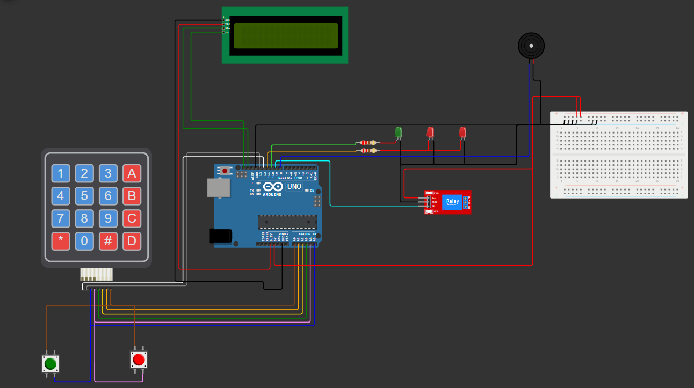

# FakeBombCS
bomba do CS feita para jogos de airsoft

# Materiais utilizados:
1x Arduino Uno R3
1x LCD 16x2
1x Teclado 4x4 
1x Buzzer Passivo
1x Potenciômetro
2x Resistores 220 ohms
1x Led Verde
2x Led Vermelho
1x Cabo de Alimentação para Arduino
1x Rele
2x Push Buttons
Fios Jumper para as conexões

# Link da Simulação 
https://wokwi.com/projects/394739396689906689

# Foto do esquema de montagem
